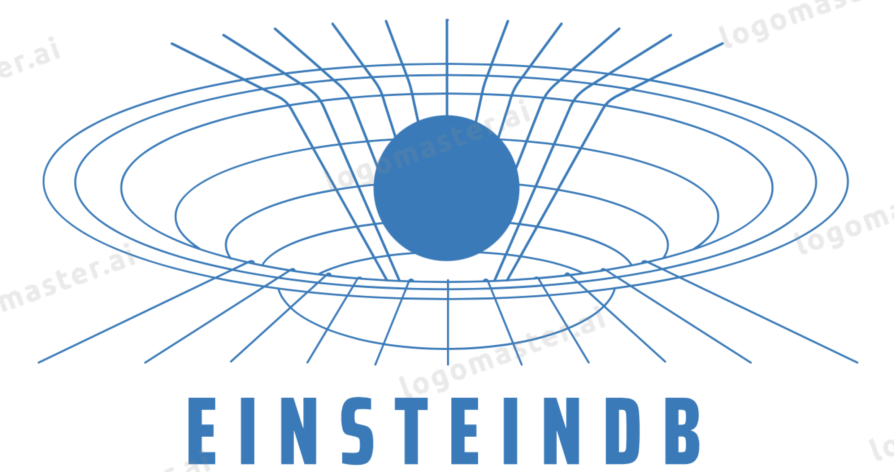

## [Website](https://www.einsteindb.com) | [Documentation](https://einsteindb.com/docs/latest/concepts/overview/) | [Community Chat](https://einsteindb.com/chat)

Persistent Causets (KV) stores are an integral part of EinsteinDB's Hybrid Index storage infrastructure. Emerging non-volatile memory (NVM) technologies are potential alternatives for future memory architecture design. EinsteinDB uses NVM to optimize the KV store (LMDB/FoundationDB) and proposes Coset Enumeration, as an embedded LSM-tree based manifold-as-feature store; built on a heterogeneous storage architecture. 

EinsteinDB's Hybrid memory systems consisting of DRAM and Non-Volatile Memory promises to persist data fast. The atomic broadcast primitive allows us to abstract away any application-specific details, such as how transactions are to be interpreted (to prevent replay attacks, for example, an application might define a transaction to include signatures and sequence numbers). For our purposes, transactions are simply unique strings. 

The index design of existing key-value stores for hybrid memory fails to utilize its specific performance characteristics: fast writes in DRAM, slow writes in NVM, and similar reads in DRAM and NVM. Since each node must output each transaction, O(1) efficiency (which our protocol achieves) is asymptotically optimal. The above definition of efficiency assumes the network is under load, reflecting our primary goal: to sustain high throughput while fully utilizing the network’s available bandwidth.EinsteinDB, a persistent tuplestore with the central idea of constructing a hybrid index in hybrid memory which already supports rich key-value operations efficiently. 

EinsteinDB exploits the distinct merits of hash index and B+-Tree index. EinsteinDB builds and persists the hash index in NVM to retain its inherent ability of fast index searching.

 EinsteinDB builds the B+-Tree index in DRAM to support range scan and avoids long NVM writes for maintaining consistency of the two indexes. Furthermore, EinsteinDB applies differential concurrency schemes to hybrid index and adopts ordered-write consistency to ensure crash consistency via interlocking directorate. 

---

EinsteinDB has the following key features:

- **Atomic Broadcasts**
    Fault tolerant state machine replication protocols provide strong safety and liveness guarantees, allowing an edb cluster to provide correct service in spite of network latency and the failure of some nodes. 
    

- **Geo-Replication wihtout zones**

    EinsteinDB uses [VioletaBFT](http://github.com/whtcorpsinc/violetabft) and FIDel to support Counting rounds in asynchronous networks. Although the guarantee of eventual delivery is decoupled from notions of “real time,” it is nonetheless desirable to characterize the running time of asynchronous protocols. The standard approach is for the adversary to assign each message a virtual round number, subject to the condition that every (r − 1)-message between correct nodes must be delivered before any (r + 1)-message is sent.

- **Value Iteration Networks**

    We introduce the value iteration network (VIN)a fully differentiable neural network with a Prolog2SQL `planning module' embedded within EinsteinDB's GPT3 Stochastic Context Free Transducer. EinstAI, an embedded RL transformer sitting atop EinsteinDB, can learn to plan, and is suitable for predicting outcomes, queries, and arena quads that involve planning-based reasoning such as policies for reinforcement learning. Key to our approach is a novel differentiable approximation of the value-iteration algorithm, which can be represented as a convolutional neural network, and trained end-to-end using standard backpropagation. We evaluate VIN based policies on discrete and continuous path-planning domains, and on a natural-language based search task.

- **Learned Indexes for Dynamic Workloads**
    The core insight of learned indexes is to view index as a distribution function from the keys to the index positions that can be approximated by deep neural networks. In EinstAI, models are fine-tuned from the weights obtained in EinsteinDB's Causet Store  from the similar data distribution, which is easier than transferring models trained from another distribution.
    

- **In-Memory Join Processing via sRDMA**
    We propose Active-Memory, a new replication protocol for RDMA-enabled high bandwidth networks, which is equipped with a novel undo-log based fault tolerance protocol that is both correct and fast.        
    

- **Built with Adjancency towards [MilevaDB](https://github.com/whtcorpsinc/milevadb)**

## EinsteinDB adopters

EinsteinDB was built with Netflix needs in mind, we thank Josh Leder for his brilliant collaboration [Netflix](https://netflix.github.io).

## EinsteinDB software stack

Basic key-value operations include Put, Get, Update, Delete, and Scan. To locate the requested key-value item, the single-key operations (Put/Get/Update/Delete) first takes exactly one key to search the index. Once the KV item is located, Get directly returns the data, and while the write operations (Put/Update/Delete) require a persist with update.

- **FIDel:**    
    FIDel is the soliton cellular automaton in charge with provisioning disjoint clusters by pruning and broadcasting QoS across the EinsteinDB specrta (MilevaDB/BerolinaSQL, VioletaBFT, FIDel, and Noether), which periodically checks for spikes and anomalies in the timne series data of high frequency, low latencym and high throughpout constraints appended to the raw packets which balance, load, and replicate run time principles automatically. To maintain a consistent hybrid index, updating both hash index and B+-Tree index for Causets(KV) writes is fundamentally required. FIDel Updates B+-Tree index involved in many writes due to sorting as well as splitting/merging of leaf nodes.

- **Causet Store:** 
    There is a LMDB store within each Causet Store and it persists data into the local disk. There exists a multitude of viable approaches to quantum gravity, among which causal set theory is perhaps the most minimalistic in terms of baseline assumptions. It is based on the hypothesis that spacetime at the Planck scale is composed of discrete ‘‘spacetime atoms’’ related by causality. These ‘‘atoms’’, hereafter called causets, possess a partial order which encodes

    all information about the causal structure of spacetime, while the number of these elements is proportional to the spacetime volume—‘‘Order + Number = Geometry’’

- **Brane:** Brane is the basic unit of tuplestore data movement. Each Brane  is replicated to multiple Nodes. These multiple replicas form a HoneyBadger BFT group via VioletaBFT. To read without blocking writes, EinsteinDB and many other database systems keep multiple immutable versions of data (often called multi-version concurrency control). A write creates a new immutable version whose timestamp is that of the write's transaction. A "snapshot read" at a timestamp returns the value of the most recent version prior to that timestamp, and does not need to block writes. It is therefore important that the timestamps assigned to versions be consistent with the order in which transactions can be observed to commit. 
- **Soliton:** A physical node in the cluster. Within each node, there are one or more Stores. Within each Store, there are many Branes.
EinsteinDB's Soliton Nodes Provide the semantics of interfacing commands for a high-bandwidth resistive memory. EinsteinDB implements the primitives for exploiting cache and search capabilities in high bandwidth resistive memories using memristive 2R cells that supports efficient reconfiguration between CAM and RAM. We also examine novel architectural mechanisms for column and row writes in XAM arrays through diagonal organization. 

When a Soliton starts, the metadata of the Soliton, Causet and Brane are recorded into FIDel's timeshare ledger. The status of each Brane and Causal Set Store  is reported to FIDel regularly.

## License

EinsteinDB is under the Apache 2.0 license. See the [LICENSE](./LICENSE) file for details.

